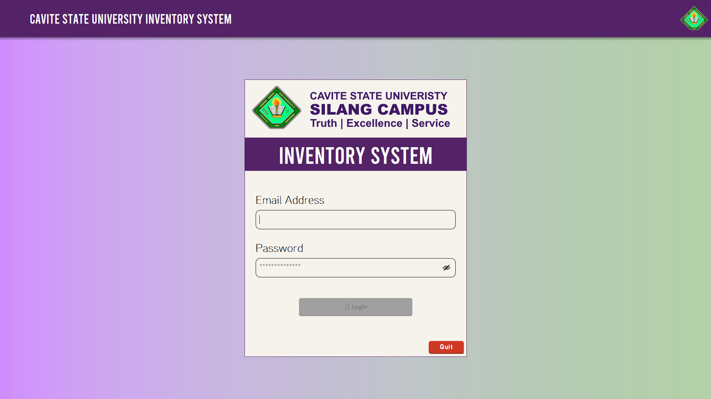
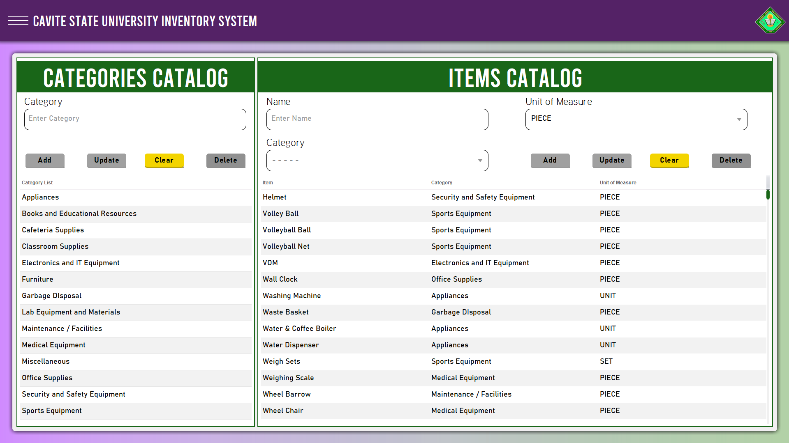
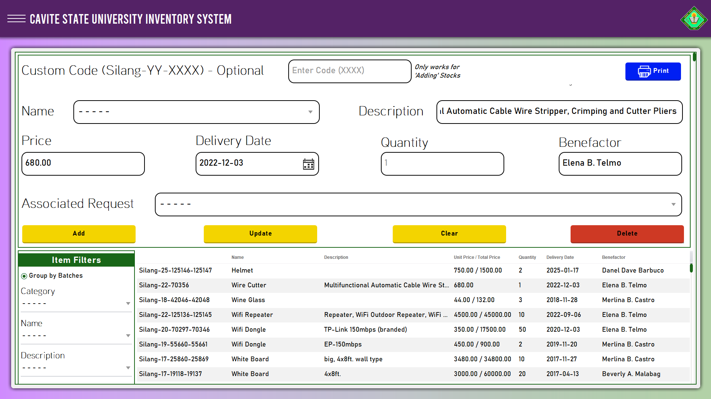
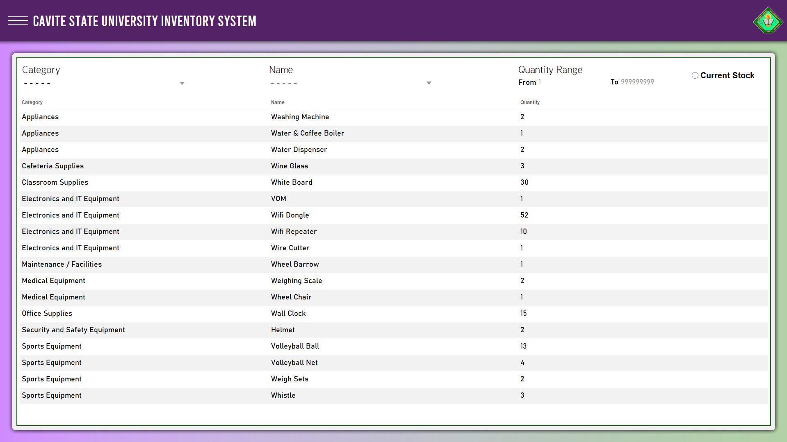
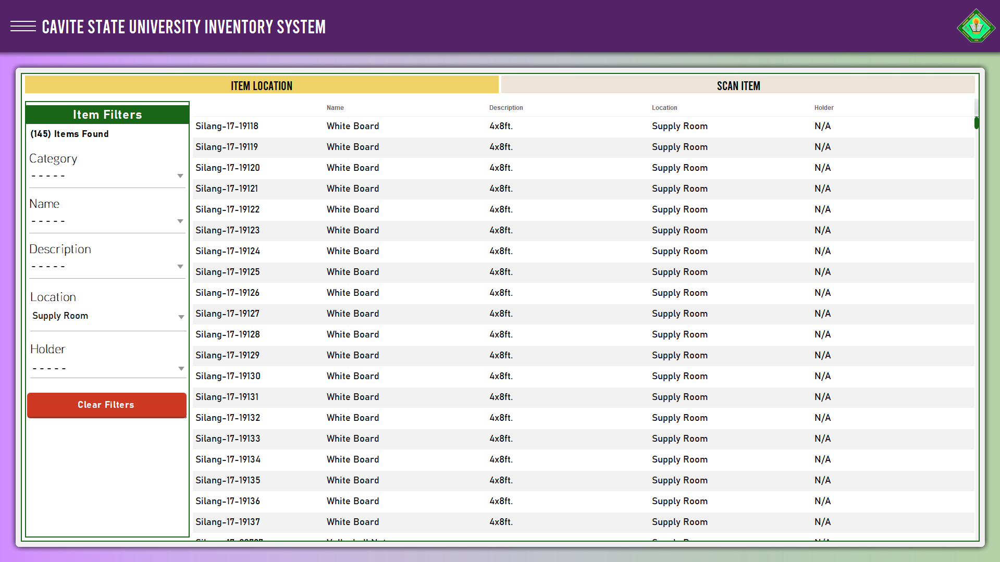
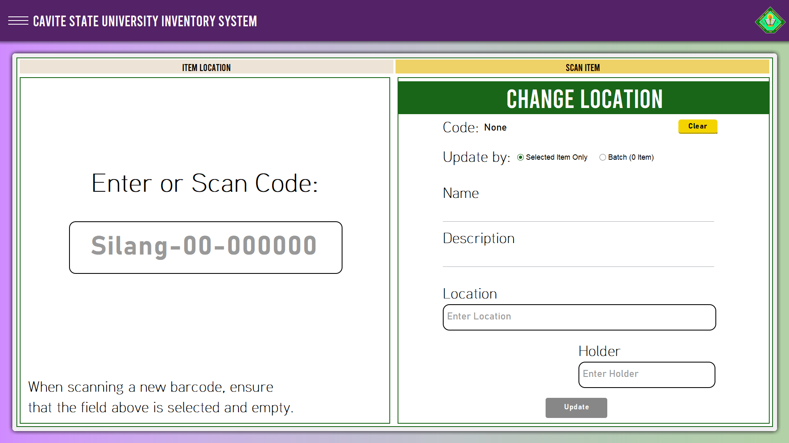
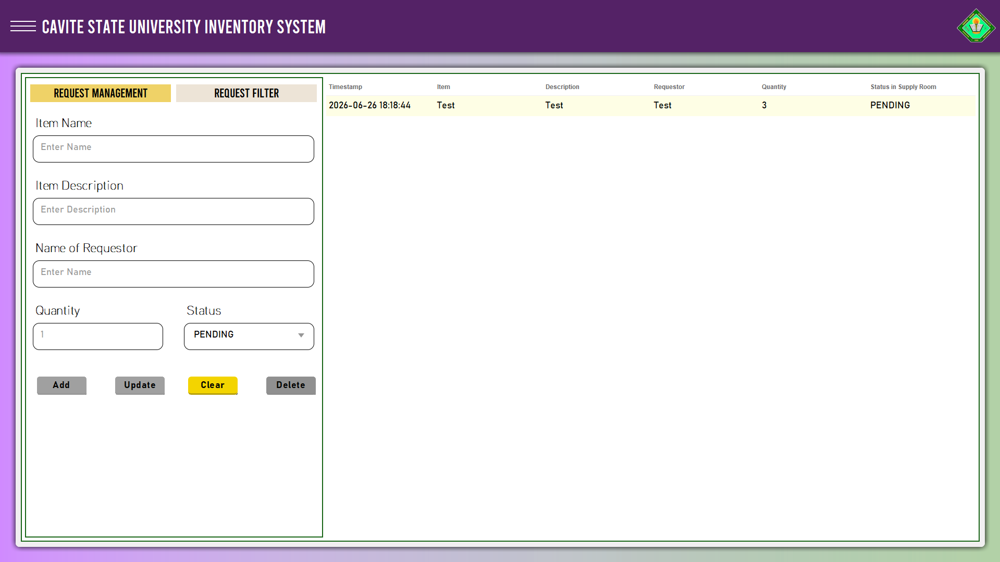
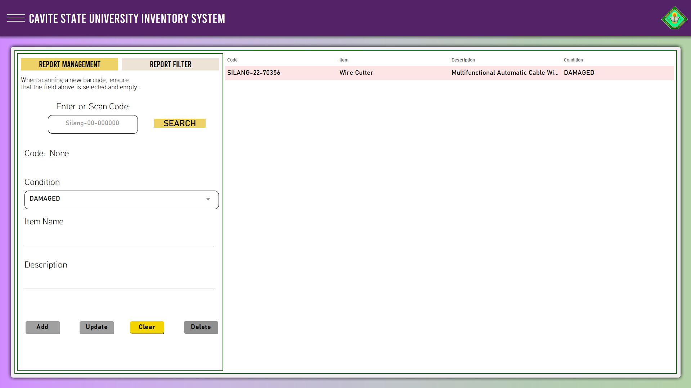
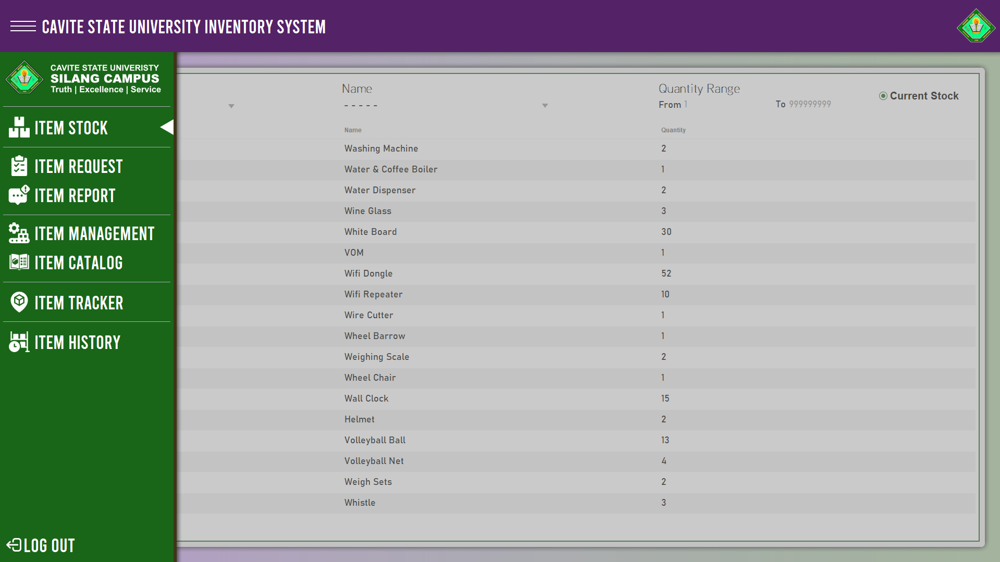

# Cavite State University Silang Inventory System

A robust asset and inventory management tool designed to track the lifecycle of university properties—from acquisition and storage to deployment and maintenance—integrated with barcode scanning technology.

---

## Core Modules & Workflow

### 1. Catalog & Management (Item Onboarding)
The system is designed to handle new acquisitions smoothly. For example, when a new delivery of air conditioning units arrives, the user logs the assets via the **Management** module.
* **Catalog:** If the item model is entirely new to the campus, a master definition is first created in the Catalog. 
* **Management Logging:** Once the definition is selected, the admin inputs specific details for the physical batch, including the description, price, delivery date, quantity, benefactor, and the specific requestor. A custom barcode is then generated for the item.

### 2. Stock & Location (Asset Tracking)
Every physical item is tagged with a printed barcode, which is essential for accurate tracking and auditing.
* **Stock:** Provides a real-time overview of all available items, their variants, and current overall quantities.
* **Location:** When an item is checked out of the inventory or moved to a different facility, the user updates its specific whereabouts in this module to maintain an accurate chain of custody.

### 3. Barcode Scanner
A dedicated scanner interface allows administrators to quickly scan an item's taped barcode, instantly pulling up the asset's database record, and current location without needing to manually search through the tables.

### 4. Requests & Incident Reports
The system allows for proactive inventory adjustments based on campus needs and equipment health.
* **Request:** Users can submit formal requests for specific items or equipment that are not currently available in the inventory.
* **Report:** Existing items can be flagged for issues (e.g., defective, damaged, or requiring maintenance), ensuring the administration can act quickly to repair or replace assets.

---

*Note: Navigation between these modules is handled via a sidebar.*

